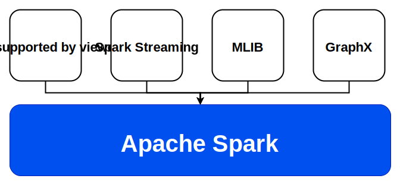
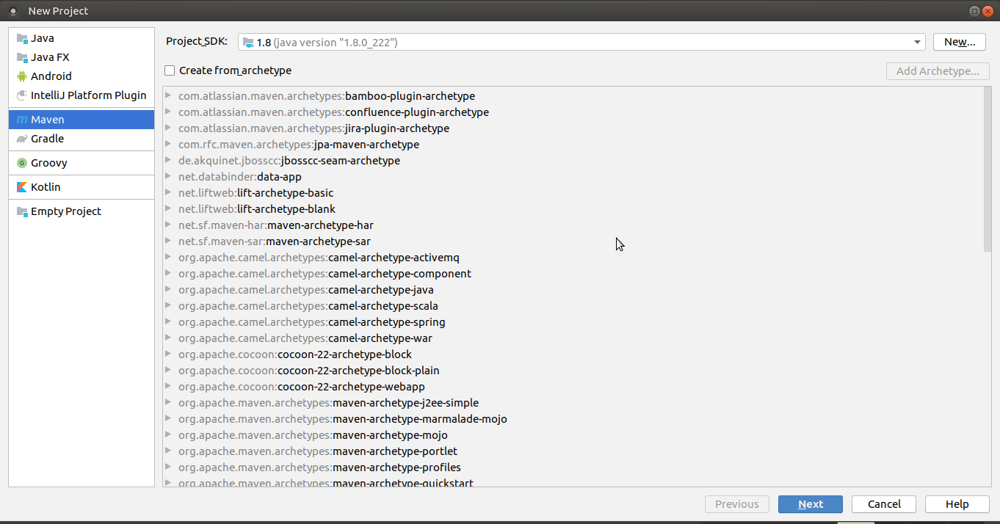
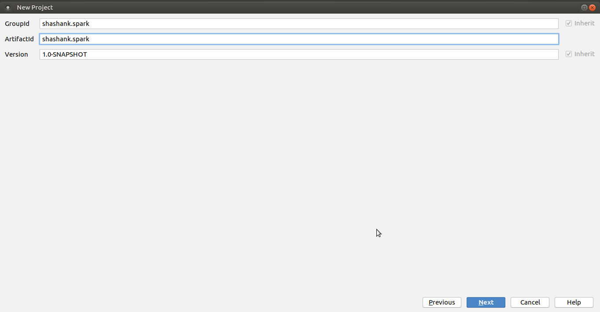
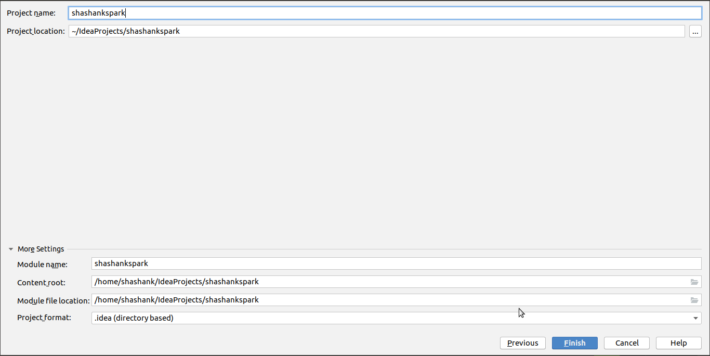
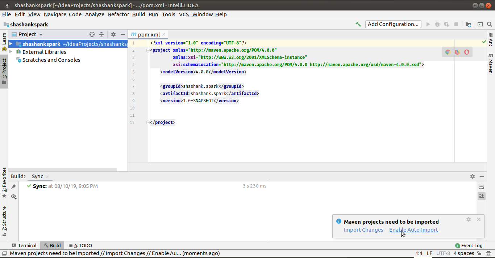

# Using Apache Spark - an example

Spark is a general-purpose distributed data processing engine that is suitable for use in a wide range of circumstances. On top of the Spark core data processing engine, there are libraries for SQL, machine learning, graph computation, and stream processing, which can be used together in an application.

The below figure shows the core architecture that `spark` provides us.


/home/shashank/Documents/GitHub/apache-spark/images

## **1** - Creating a maven project

We will be coding with java and use maven as our build tool. The below code file shows the maven dependency file `pom.xml`. Just copy and paste the contents of the file into your `pom.xml` file that is generated.

Before that let's create a barebone maven project. I prefer using `Intellij IDEA Community Edition` on my Ubuntu Mate Desktop. The below series of pictures shows creating a successful maven project.

> Fig : Creating a maven project - step1


> Fig: Creating a maven project - step2


> Fig: Creating a maven project - step3


> Fig: Enable auto import to avoid manual imports everytime



After successful creation of project copy the below dependencies to your `pom.xml` file. The file can be found [here](../../code/dependencies/maven-1/pom.xml)

Maven might take some time depending on your internet connection to download the required dependencies for running spark.

Our basic structure of project might look like the one showed below.

```c
.
├── pom.xml
├── src
│   ├── main
│   │   ├── java
│   │   └── resources
│   └── test
└── target
```

We now create a main class named `Application.java` under `java` directory.
This will be the starting point of our application.

```c
.
├── pom.xml
├── src
│   ├── main
│   │   ├── java
│   │   │   └── Application.java
│   │   └── resources
│   └── test
└── target
```

## `Application.java`

Let us first import the necessary packages.

```java
import org.apache.spark.sql.Dataset;
import org.apache.spark.sql.Row;
import org.apache.spark.sql.SparkSession;

import static org.apache.spark.sql.functions.*;
```

#### The main method

```java
public class Application {
    public static void main (String[] args) {
        // first let's build a spark session
        SparkSession 
            spark = new 
                    SparkSession.Builder()
                            .master ("local")
                            .getOrCreate();

        // For dataset - durham-parks.json
        // Link - https://catalog.data.gov/dataset/city-parks
        Dataset<Row> dfbuildDD = buildDD(spark);
        dfbuildDD.show(10);

        // For dataset - Philadelphia_recreations.csv
        // Link - https://www.opendataphilly.org/dataset
        Dataset<Row> dfbuildPPD = buildPPD(spark);
        dfbuildPPD.show(20);
    }
}
```

### The buildDD method

In this method we will read the contents of `durham-parks.json` file and try to modify some of the rows. We will try to concat new rows to the existing `Dataset`.

```java
// first we read the Dataset
Dataset<Row> 
    df = spark
            .read()
            .format("json")
            .option("multiline", true)
            .load("src/main/resources/durham-parks.json");
```

Now we modify the columns. This can we achieved by the function `withColumn` which is applied on `Dataset` instance.

```java
df = df.withColumn("park_id",
            concat(
                    df.col("datasetid"),
                    lit("_"),
                    df.col("fields.objectid"),
                    lit("_Durham")
                )
            )
```

Similarly, for another column for `park_name`.

```java
.withColumn(
             "park_name",
            df.col("fields.park_name")
        )
```

Similarly, for another column for `city`.

```java
.withColumn(
            "city",
            lit("Durhma")
    )
```

Similarly, for some other columns.

```java
.withColumn(
            "has_playground",
            df.col("fields.playground")
        )
        .withColumn(
            "zipcode",
             df.col("fields.zip")
        )
        .withColumn(
            "land_in_acres",
            df.col("fields.acres")
        )
        .withColumn(
            "geoX",
            df.col("geometry.coordinates")
            .getItem(0)
        )
        .withColumn(
            "geoY",
            df.col("geometry.coordinates")
            .getItem(1)
        );
```
At the end we return the `Dataset` instance `df`.

```java'
return df;
```

### buildPPD method

```java
public static Dataset<Row> buildPPD (SparkSession spark) {
        // populate the dataframe
        Dataset<Row> 
            df = spark
                    .read()
                    .format("csv")
                    .option("multiline", true)
                    .option("header", true)
            .load("src/main/resources/philadelphia_recreations.csv");

        df = df.filter(
            lower(df.col("USE_"))
            like("%park%")
        );

        return df;
    }
```

So when we sun the spark program we get the output which is quite pretty big. You can find the output [here](./pro1.txt).


