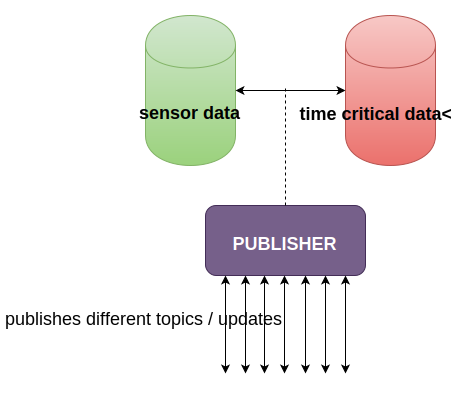
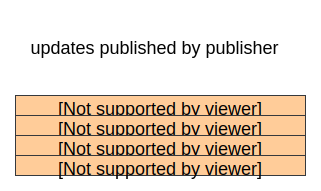

# The design of Robust pub - sub agents with C

Implementation of Wireless communication in aerospace industry to reduce the wiring is everyone's idea and many papers present what should be used for communication but I found very few papers on how and what patterns of communications must the avionics intra-communications should follow.

So I start respresenting few models, some designed according to my idealogy and some patterns which are inspired by Distributed Systems.

## The pub-sub model (publisher-subscriber pattern)

The pattern that I am demonstrating is not just a typical `publisher-subscriber` pattern but programs built with `reliability`, `scalability` and `flexibility` in mind.

## Features of publisher

> (1) `Publisher publishes messages or updates to its subscribers.`

> (2) `Publisher has the ability to publish `n` number of messages with different topics.`

> (3) `A single publisher can publish it's updates to few thousands or few hundred thousand subscribers.`

> (4) `If disconnected, the publisher automatically reconnects and starts publishing the updates to its subscribers.`

> (5) `A broker can be implemented between `publisher` and `subscriber` to perform time critical operations such as invoking `RPC's`, `control systems` etc.`

Consider the following block diagram which demonstrates the flow.



Now let's code the publisher, first we create a `context` using `zmq_ctx_new()` function. Create a `publisher` socket with the help of `zmq_socket()` function and bind the port `8080`.
```c
void *context = zmq_ctx_new ();
void *publisher = zmq_socket (context, ZMQ_PUB);
```

Necessary port and ipc bindings.

```c
int rc = zmq_bind (publisher, "tcp://*:8080");
assert (rc == 0);
rc = zmq_bind (publisher, "ipc://weather.ipc");
assert (rc == 0);
```

Start publishing ....

```c
// prepare the update
char update[20];

// generate some random numbers
int zipcode, temperature, humidity;
zipcode = random (10000);
temperature = random (176);
humidity = random (343);

// say weather update
sprintf (update, "%05d %d %d", zipcode, temperature, humidity);

// publish
s_send (publisher, update);
```

An array of updates can be shown below.



Now lets, turn to the subscriber part.

## Features of subscriber

> (1) `A subscriber can subscribe to any number of topics published by the publisher.`

> (2) `In subscriber get's the updates of the topics that it is subscribed for. Other update topics are dropped off at the socket.`

> (3) `A subscriber can subscribe to many publisher topics.`

